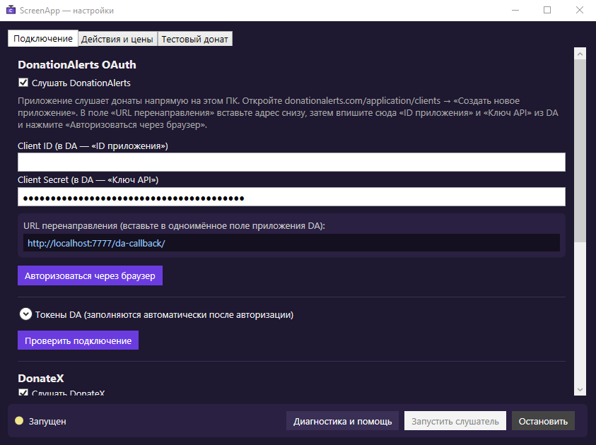
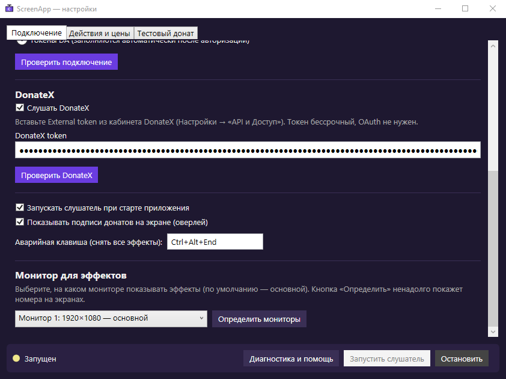
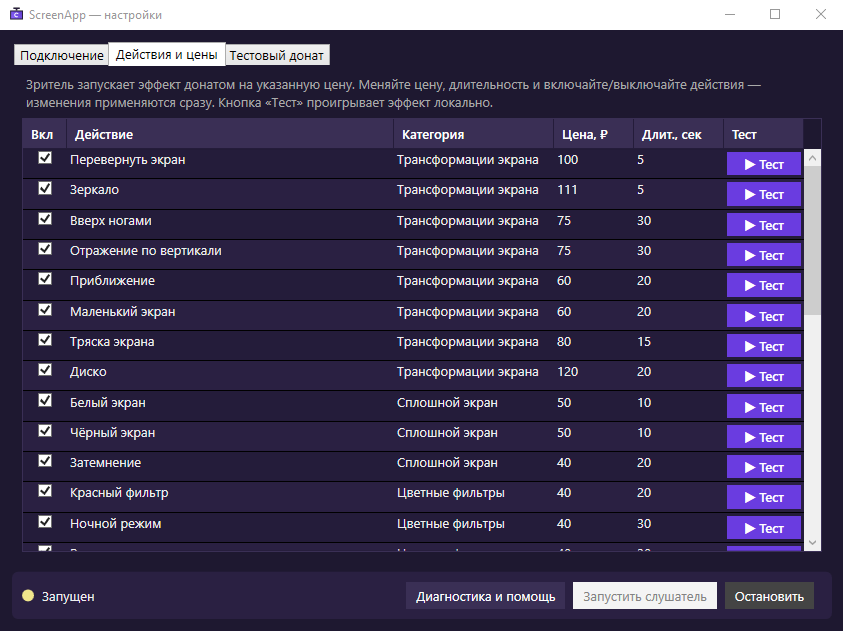
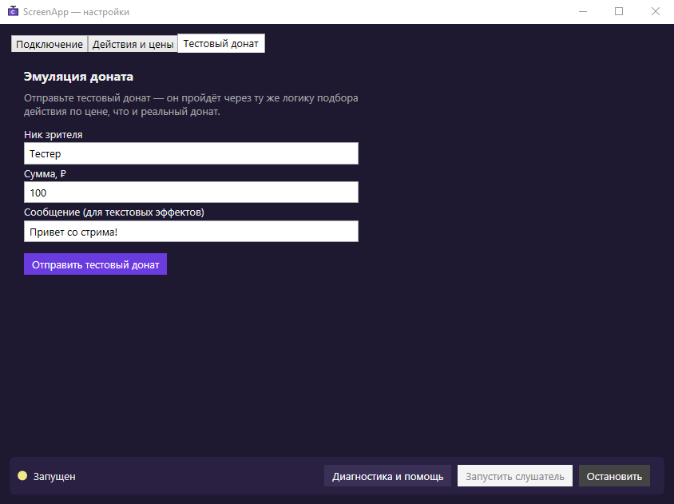
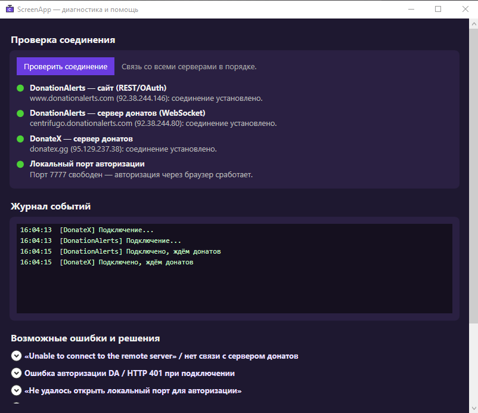

# ScreenApp — эффекты на экране за донаты

ScreenApp превращает донаты зрителей в эффекты на твоём экране: зритель донатит — и
экран переворачивается, сыплется конфетти, гаснет, появляется надпись и так далее.
Поддерживаются **DonationAlerts** и **DonateX**. Всё работает прямо на твоём ПК,
никаких сторонних серверов.

> Как это работает: ты задаёшь цену каждому эффекту. Зритель донатит ровно эту сумму —
> эффект включается на заданное время и сам выключается.

## Установка

1. Скачай `ScreenApp.exe` со страницы [Releases](../../releases).
2. Запусти его **от имени администратора** (правый клик → «Запуск от имени администратора»).
   Это нужно, чтобы работали все эффекты (например, блокировка мыши/клавиатуры).
3. Появится значок в трее (внизу справа, у часов). Двойной клик по нему открывает настройки.

Устанавливать ничего больше не нужно — всё уже внутри одного файла.

## Подключение DonationAlerts

1. Открой [donationalerts.com/application/clients](https://www.donationalerts.com/application/clients)
   и нажми **«Создать новое приложение»**.
2. В поле **«URL перенаправления»** вставь адрес, который показан в настройках ScreenApp
   (`http://localhost:7777/da-callback/`), и сохрани.
3. Скопируй из DonationAlerts **«ID приложения»** и **«Ключ API»** в поля **Client ID** и
   **Client Secret** в ScreenApp.
4. Нажми **«Авторизоваться через браузер»** и подтверди вход.
5. Нажми **«Проверить подключение»** — появится твой ник.



## Подключение DonateX

1. В кабинете DonateX открой **Настройки → «API и Доступ»** и скопируй токен.
2. Вставь его в поле **«DonateX token»** в ScreenApp.
3. Нажми **«Проверить DonateX»** — появится твой ник.

Можно подключить оба сервиса сразу или только один — галочками «Слушать…» выбираешь,
что слушать. Здесь же выбирается монитор для эффектов и автозапуск.



## Настройка эффектов

На вкладке **«Действия и цены»**:

- включай галочкой нужные эффекты;
- ставь **цену** (на какую сумму доната срабатывает эффект);
- ставь **длительность** в секундах;
- кнопка **«▶ Тест»** проигрывает эффект прямо сейчас, без реального доната.

Совет: задавай разным эффектам разные цены, иначе на одну сумму сработает только первый.



После настройки нажми **«Запустить слушатель»** — и можно стримить.

Хочешь проверить, как всё выглядит, без реального доната? На вкладке **«Тестовый донат»**
введи сумму и сообщение и отправь — эффект сработает так же, как от настоящего доната.



## Полезное

- **Несколько мониторов?** В настройках выбери, на каком мониторе показывать эффекты.
  Кнопка «Определить мониторы» подскажет, где какой.
- **Подписи донатов** на экране («ник — сумма — действие») можно включить или выключить.
- **Аварийная клавиша** `Ctrl+Alt+End` мгновенно убирает все эффекты (на случай, если
  что-то мешает). Комбинацию можно изменить в настройках.
- **Кнопка «Диагностика и помощь»** проверит связь с серверами и подскажет, что делать
  при проблемах.

## Если донаты не приходят

Чаще всего сервис донатов недоступен у провайдера — **включи VPN** и нажми «Запустить
слушатель» заново. Проверить, что именно недоступно, можно в окне **«Диагностика и
помощь»** → «Проверить соединение».



## Поддержать автора

Приложение бесплатное. Если хочешь сказать спасибо — в приложении есть кнопка
**«💜 Поддержать»** (в настройках и в меню трея):

- DonateX: https://donatex.gg/donate/Twenix
- USDT (TRC20): `TBAFE73JqAUMVCeDKm2mXdC84PHYKn71Lx`

## Лицензия

Свободное и бесплатное ПО для всех. Лицензия MIT — см. [LICENSE](LICENSE).

---

<details>
<summary>Для разработчиков (сборка из исходников)</summary>

Требуется [.NET 8 SDK](https://dotnet.microsoft.com/download) на Windows.

```powershell
powershell -ExecutionPolicy Bypass -File build.ps1
# или вручную:
dotnet test ScreenApp.sln -c Release
dotnet publish ScreenApp/ScreenApp.csproj /p:PublishProfile=win-x64
```

Готовый файл: `ScreenApp/bin/Release/net8.0-windows/win-x64/publish/ScreenApp.exe`.

Релиз с `.exe` на GitHub собирается автоматически при пуше тега (`git tag v2.0.0 && git push origin v2.0.0`) —
см. `.github/workflows/release.yml`.

</details>
